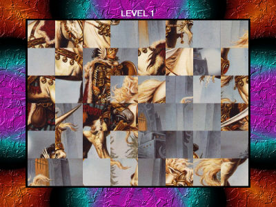



## Jigsaw Puzzles \(Lots of good multimedia effects\)

### Description

A game in which you have to solve a series of 11 jigsaw puzzles of increasing difficulty. Lots of good multimedia effects.
 
### More Info
 

             |
---                |---
**Submitted On**   |2001-04-26 22:00:12
**By**             |[Alexander Anikin](https://github.com/Planet-Source-Code/PSCIndex/blob/master/ByAuthor/alexander-anikin.md)
**Level**          |Intermediate
**User Rating**    |4.8 (19 globes from 4 users)
**Compatibility**  |VB 5\.0, VB 6\.0
**Category**       |[Games](https://github.com/Planet-Source-Code/PSCIndex/blob/master/ByCategory/games__1-38.md)
**World**          |[Visual Basic](https://github.com/Planet-Source-Code/PSCIndex/blob/master/ByWorld/visual-basic.md)
**Archive File**   |[Jigsaw Puz189534292001\.zip](https://github.com/Planet-Source-Code/alexander-anikin-jigsaw-puzzles-lots-of-good-multimedia-effects__1-22779/archive/master.zip)

